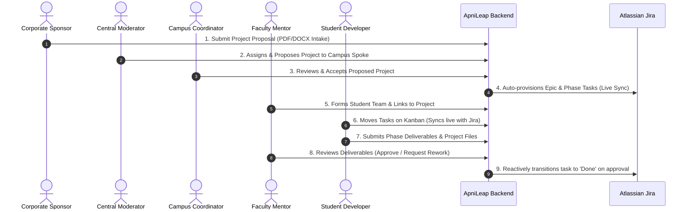

# ApniLeap OS

<div align="center">


### Enterprise Academic-Corporate Project Orchestration Platform

[](https://reactjs.org/)
[](https://vitejs.dev/)
[](https://nodejs.org/)
[](https://expressjs.com/)
[](https://www.postgresql.org/)
[](https://www.prisma.io/)
[](https://www.atlassian.com/software/jira)

**ApniLeap OS** is an end-to-end multi-tenant platform designed to streamline and orchestrate B2B industry-academia partnerships, sponsored student capstones, and institutional project deployments across distributed university campuses.

</div>

---

## 📌 Table of Contents
- [Platform Overview](#-platform-overview)
- [End-to-End Workflow](#-end-to-end-workflow)
- [User Roles & Personas](#-user-roles--personas)
- [Core Features](#-core-features)
- [System Architecture](#-system-architecture)
- [Project Structure](#-project-structure)
- [Getting Started](#-getting-started)
  - [Prerequisites](#prerequisites)
  - [Backend Setup](#1-backend-setup)
  - [Frontend Setup](#2-frontend-setup)
  - [Environment Variables](#3-environment-configuration)
- [Atlassian Jira Integration](#-atlassian-jira-integration)
- [Contributing & License](#-license)

---

## 🌐 Platform Overview

Bridging the gap between corporate R&D sponsors and university engineering colleges often suffers from fragmented tools, manual email approvals, and delayed milestone tracking. 

**ApniLeap OS** provides a unified **Hub-and-Spoke** platform connecting:
* **The Central Hub:** Corporate Sponsors (NVIDIA, Intel, Google) and Executive Moderators.
* **Campus Spokes:** Partner universities (e.g., KLE Technological University, COEP, MMCOEP, RIT).
* **Execution Units:** Faculty mentors guiding student cohorts working on live industrial problem statements with direct Jira issue tracking.

---

## 🔄 End-to-End Workflow



### The 6-Stage Process:
1. **Intake & Proposal Creation:** The **Corporate Sponsor** submits project proposals with budget, duration, technical requirements, and milestone phases (supported by automated PDF/DOCX parsing).
2. **Campus Allocation:** The **Central Moderator** reviews pending proposals and allocates them to target campus spokes (e.g., KLE Spoke).
3. **Campus Acceptance & Automated Jira Provisioning:** The **Campus Coordinator** accepts the project. ApniLeap automatically calls the Atlassian Jira REST API to generate an Epic, create child tasks for each project phase, compute milestone deadlines, and populate the live Kanban Board.
4. **Team Formation:** The **Faculty Mentor** creates the student team and assigns student developers to the active project.
5. **Kanban Execution:** **Student Developers** move their assigned phase tasks across *Backlog*, *In Progress*, and *Done*. Every drag-and-drop triggers live Jira API status transitions.
6. **Deliverable Review & Reactive Closure:** Students submit project code and reports. When the **Faculty Mentor** approves the submission, the system automatically transitions the corresponding Jira ticket to **Done** and updates project metrics in real time.

---

## 👥 User Roles & Personas

| Role | Target Persona | Permissions & Capabilities |
| :--- | :--- | :--- |
| **Corporate Sponsor** | `project_mentor@nvidia.com` | Submits B2B proposals, monitors portfolio health, tracks milestones across colleges. |
| **Central Moderator** | `admin@apnileap.com` | Global administrative governance, allocates projects to universities, manages institutional risk. |
| **Campus Coordinator** | `kle@apnileap.com` | Accepts/declines proposed projects for the campus, oversees spoke metrics, schedules sync meetings. |
| **Faculty Mentor** | `anitasharma@kle.in` | Creates student teams, assigns sprint tasks, reviews phase deliverables, grades submissions. |
| **Student Developer** | `manasa@kle.edu` | Views assigned Kanban board, transitions task cards, uploads phase deliverables, participates in team chat. |

---

## ✨ Core Features

### 📑 Smart Proposal Intake (Document Parser)
* Automated ingestion of `.pdf` and `.docx` proposal documents using `pdf-parse` and `mammoth`.
* Regex-driven extraction of project title, sponsor, budget, scope, requirements, and multi-phase timelines.

### 📋 Live Atlassian Jira Kanban Synchronization
* Native bidirectional integration with Atlassian Jira Agile boards (`/rest/agile/1.0/board`).
* Drag-and-drop Kanban board powered by `react-beautiful-dnd`.
* Dragging task cards automatically fires transition workflows (`/rest/api/3/issue/{key}/transitions`).

### 🎓 Team & Mentorship Management
* Dynamic student team builder with leader designations, member allocations, and mentor pairing.
* Role-based access control (RBAC) powered by JWT authentication and Prisma ORM.

### 📤 Reactive Deliverable Submission & Review Loop
* Students upload files or submit repository links for phase evaluations.
* Mentors approve or request rework. Automated reactive triggers update task statuses and Jira tickets on approval.

### 📅 Calendar Sync & Team Communication
* Built-in meeting scheduler for cadence syncs, sprint reviews, and blocker escalations.
* Real-time campus-specific chat channel.

### 🤖 AI Rovo Assistant
* In-app intelligent conversational assistant to summarize sprint progress, surface blocked tickets, and draft milestone evaluations.

---

## 🛠️ System Architecture

```
┌────────────────────────────────────────────────────────┐
│               Frontend (React 18 + Vite)               │
│  Tailwind / Custom CSS  •  Recharts  •  React-Dnd UI   │
└───────────────────────────┬────────────────────────────┘
                            │ HTTP / REST API
┌───────────────────────────▼────────────────────────────┐
│              Backend (Node.js + Express)               │
│   Auth Middleware  •  Upload Handlers  •  Jira Router  │
└─────────────┬────────────────────────────┬─────────────┘
              │                            │
   Prisma ORM │                            │ Atlassian REST API
┌─────────────▼──────────────┐  ┌──────────▼─────────────┐
│    PostgreSQL Database     │  │  Atlassian Jira Cloud  │
│  Users, Projects, Teams,   │  │ Epics, Tasks, Sprints, │
│  Meetings, Submissions     │  │ Boards & Transitions   │
└────────────────────────────┘  └────────────────────────┘
```

---

## 📂 Project Structure

```bash
apnileap/
├── backend/
│   ├── middleware/        # JWT Authentication and security middleware
│   ├── models/            # Schema adapters & data models
│   ├── prisma/
│   │   └── schema.prisma  # PostgreSQL Prisma schema definitions
│   ├── routes/            # Express route controllers (auth, docs, notifications)
│   ├── uploads/           # Uploaded deliverables and proposal files
│   ├── utils/             # Mailer, Confluence, and Jira utility services
│   ├── jira-setup.js      # Board and filter provisioning script
│   ├── seed.js            # Comprehensive database seeder with mock personas
│   └── server.js          # Main Express server and Jira integration layer
│
├── frontend/
│   ├── public/            # Static assets and avatars
│   ├── src/
│   │   ├── assets/        # Media assets and logos
│   │   ├── components/    # Modular React views (Kanban, Calendar, TeamChat, etc.)
│   │   ├── App.jsx        # Root application and dashboard router
│   │   ├── index.css      # Design system & dark-mode styling
│   │   └── main.jsx       # React application entry point
│   ├── index.html         # HTML entry
│   └── vite.config.js     # Vite configuration
│
├── .gitignore             # Git ignore definitions
└── README.md              # Project documentation
```

---

## 🚀 Getting Started

### Prerequisites
* **Node.js**: v18.0.0 or higher
* **PostgreSQL**: v14 or higher (or a hosted PostgreSQL service like Neon, Supabase, or AWS RDS)
* **Atlassian Jira Account**: (Optional for mock mode; required for live Jira synchronization)

---

### 1. Backend Setup

1. Open a terminal and navigate to the backend directory:
   ```bash
   cd backend
   ```

2. Install dependencies:
   ```bash
   npm install
   ```

3. Configure your environment file:
   ```bash
   cp .env.example .env # or create a new .env file
   ```
   *(See [Environment Configuration](#3-environment-configuration) below for details)*

4. Generate Prisma client and push the schema to your database:
   ```bash
   npx prisma generate
   npx prisma db push
   ```

5. *(Optional)* Seed initial mock data (users, sample projects, campus teams):
   ```bash
   node seed.js
   ```

6. Start the backend server:
   ```bash
   npm run dev
   # Server runs on http://localhost:5001
   ```

---

### 2. Frontend Setup

1. Open a separate terminal and navigate to the frontend directory:
   ```bash
   cd frontend
   ```

2. Install dependencies:
   ```bash
   npm install
   ```

3. Launch the Vite development server:
   ```bash
   npm run dev
   # Vite development server runs on http://localhost:5173
   ```

4. Open your browser and navigate to `http://localhost:5173`.

---

### 3. Environment Configuration

Create a `.env` file in the `backend/` folder with the following variables:

```env
# Database Configuration (PostgreSQL)
DATABASE_URL="postgresql://<USER>:<PASSWORD>@localhost:5432/apnileapos?schema=public"

# Atlassian Jira Cloud Integration (Required for live Jira sync)
JIRA_DOMAIN="https://<YOUR_WORKSPACE>.atlassian.net"
JIRA_EMAIL="your-jira-account-email@example.com"
JIRA_API_TOKEN="your_jira_api_token"

# JWT Secret
JWT_SECRET="your_jwt_secret_key"

# Email SMTP Notification Service (Optional)
SMTP_HOST="smtp.gmail.com"
SMTP_PORT="465"
SMTP_SECURE="true"
SMTP_USER="your-email@gmail.com"
SMTP_PASS="your-app-password"
SMTP_FROM_NAME="ApniLeap Hub"
```

> **Tip:** You can generate a Jira API token by visiting [Atlassian API Tokens](https://id.atlassian.com/manage-profile/security/api-tokens).

---

## 🔗 Atlassian Jira Integration

When configured with valid Jira credentials, ApniLeap automatically handles:
* **Project Board Provisioning:** Run `node jira-setup.js` to create automated agile filters and boards for each campus spoke.
* **Bi-directional Task Transitions:** Any ticket dragged across the Kanban columns (*Backlog* → *In Progress* → *Done*) executes a live transition query against Jira's workflow engine.
* **Offline Circuit Breaker:** If Jira credentials are not provided or Atlassian services are temporarily unreachable, the platform gracefully falls back to local database persistence without crashing.

---

## 🔑 Pre-seeded Testing Accounts

| Persona | Email | Password | Campus / Spoke |
| :--- | :--- | :--- | :--- |
| **Central Admin** | `admin@apnileap.com` | `admin123` | Central Hub |
| **Company Sponsor** | `sponsor@company1.com` | `spoke123` | Corporate |
| **KLE Coordinator** | `kle@apnileap.com` | `spoke123` | KLE Tech (Spoke 3) |
| **COEP Coordinator** | `coep@apnileap.com` | `spoke123` | COEP (Spoke 101) |
| **Faculty Mentor** | `anitasharma@kle.in` | `faculty123` | KLE Tech (Spoke 3) |
| **Student Developer** | `manasa@kle.edu` | `student123` | KLE Tech (Spoke 3) |

---

## 📄 License

This project is licensed under the MIT License — see the [LICENSE](LICENSE) file for details.

<div align="center">
Built with ❤️ to empower university-industry collaboration.
</div>
